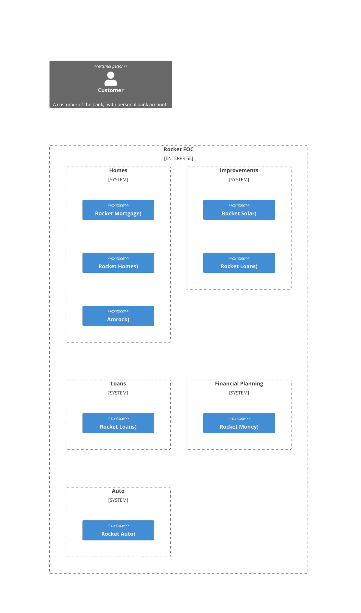

```mermaid
C4Component
    Person_Ext(customer, "Customer", "A customer of the bank,`with personal bank accounts")
    Enterprise_Boundary(e1, "Rocket FOC") {
        System_Boundary(h, "Homes") {
            Container(mrtg, "Rocket Mortgage)")
            Container(rkthomes, "Rocket Homes)")
            Container(amrock, "Amrock)")
        }
        System_Boundary(i, "Improvements") {
            Container(solar, "Rocket Solar)")
            Container(loans, "Rocket Loans)")
        }
        System_Boundary(l, "Loans") {
            Container(l.loans, "Rocket Loans)")
        }
        System_Boundary(f, "Financial Planning") {
            Container(money, "Rocket Money)")
        }
        System_Boundary(a, "Auto") {
            Container(a.auto, "Rocket Auto)")
        }
    }

```